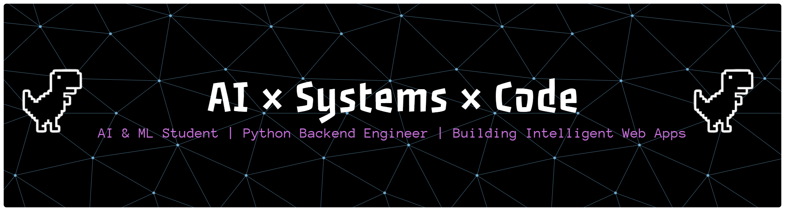

<h1>Hi, I'm Omkar!! 👋 (AI Student | Backend Engineer | Automation Enthusiast)</h1>

  

 

  

 

  
  
  
  
  

 

  

---

  <h2 style="color: #ffffff; font-weight: 800; font-size: 28px; margin-bottom: 10px;">🧠 About Me</h2>
  

  
  

    I am an <b>AI & ML student</b> on a mission to bridge the gap between intelligent systems and the modern web. 
    My work converges at the intersection of <b>robust backend engineering</b> and <b>automated intelligence</b>. 
    I don't just write code; I architect systems that scale, optimize workflows that matter, and build 
    data-driven solutions that solve real-world problems.
  

  

    <i>"Building smarter workflows. Optimizing systems. Shipping real projects."</i>
  

---

## 🛠 Tech Arsenal
 

  

 

| Category       | Tools                                |
| ---------------|--------------------------------------|
| **Languages**  | Python, C++, React (learning)        |
| **Backend**    | Django, DRF, Supabase                |
| **Systems**    | Linux, AOSP                          |
| **Dev Tools**  | Git, GitHub, VS Code, Android Studio |
| **Deployment** | Docker, Render                       |

---

## 🚀 Current Learning Focus

  
  
  
  

* **AI + Backend integration**
* **CUDA & parallel computing**
* **Scalable backend systems**

---

## 📊 GitHub Dashboard

  

  
  

  

---

## 🌐 Connect With Me

  
  

   
  

